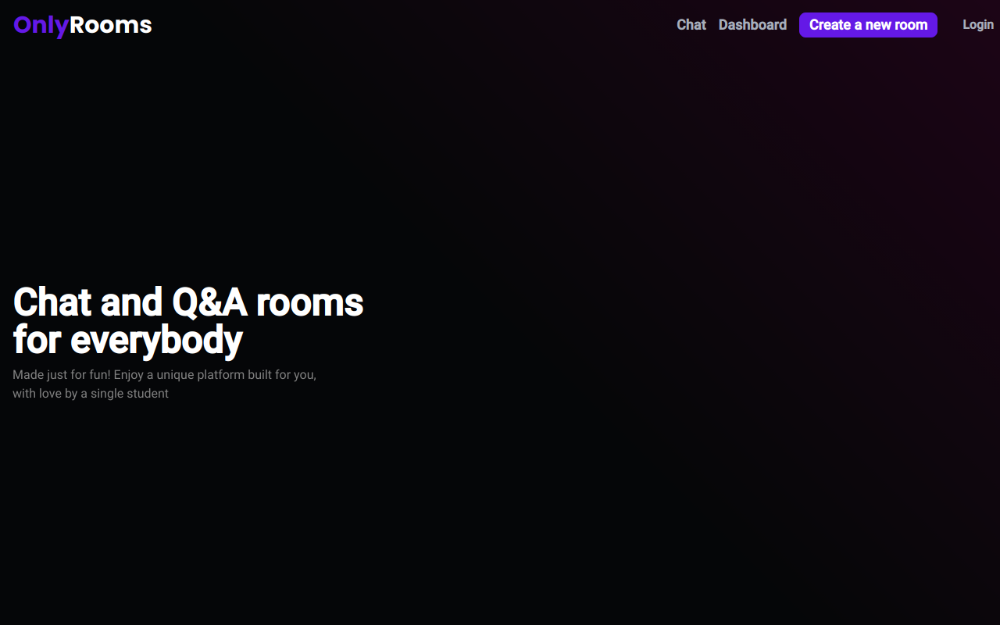

<div align="center">


<br />

# OnlyRooms | Rooms for everybody

[](https://github.com/SlyCooper-n)
[](https://github.com/SlyCooper-n/letmeask-nlw6-react/blob/main/package.json)
[](https://github.com/SlyCooper-n/onlyrooms/issues)
[](https://github.com/SlyCooper-n/onlyrooms/blob/main/LICENSE)


</div>

<br />

> This was generated by [bash scripts](https://github.com/SlyCooper-n/models) to start with a Next.js template. <br />
> Live demo [here](https://onlyrooms.vercel.app).

## Table of Contents

- [General Info](#pushpin-general-information)
- [Technologies Used](#hammer-technologies-i-used)
- [Features](#sparkles-features)
  - [What's next?](#eye-curious-to-see-whats-coming-next)
- [Screenshots](#camera-screenshots)
- [Setup](#rocket-running-this-project)
  - [Contributing](#brain-thinking-of-contributing-to-the-project)
<!-- - [Usage](#question-usage) -->
- [Project Status](#heavy_check_mark-project-status)
- [Acknowledgement](#white_heart-acknowledgement)
- [License & Contact](#memo-license--contact)

## :pushpin: General Information

<!-- 
Provide general information about your project here.

- What problem does it (intend to) solve?
- What is the purpose of your project?
- Why did you undertake it?
-->

This project was developed in order to practise web development using Next.js and Firebase to provide real-time rooms. I'll be improving this project from now on to keep evolving my knowledge and maybe create something cool for people to use. I've built some small features on top of that one, like PWA and dark mode support. But that's not all, I'm aiming to add [this feedback feature](https://github.com/SlyCooper-n/feedback-widget-nlw-08) inside this web app in the near future as well as CI with Github Actions.

> For more information about my dev journey, consider visiting my [LinkedIn](https://linkedin.com/in/gabriel-vs-frasao).

## :hammer: Technologies I Used

<details>
<summary>
Base tools
</summary>

- [Next.js](https://nextjs.org/) v12.2.2
- [Firebase](https://firebase.google.com/) v9.9.0
- [TypeScript](https://www.typescriptlang.org/) v4.7.4

</details>

<details>
<summary>
Styling
</summary>

- [Tailwind](https://tailwindcss.com/) v3.1.6
- [DaisyUI](https://daisyui.com/) v2.19.1
- [RadixUI](https://www.radix-ui.com/) (version per component)

</details>

<details>
<summary>
Linters and Formatters
</summary>

- [ESLint](https://eslint.org/) v8.20.0
- [Prettier](https://prettier.io/) (VS Code extension)
- [.editorConfig](https://editorconfig.org/) (VS Code extension)

</details>

<details>
<summary>
Testing
</summary>

- [Vitest](https://vitest.dev/) v0.18.1
- [React testing library](https://testing-library.com/docs/react-testing-library/intro/)
  - jest-dom v5.16.4
  - react v13.3.0
  - user-event v14.3.0
- [Cypress](https://www.cypress.io/) v10.3.1

</details>

## :sparkles: Features

- [x] Real-time rooms
- [ ] Chat rooms
- [x] PWA support
- [x] Dark and Light theme

### :eye: Curious to see what's coming next?

[Stay tuned right here](https://github.com/users/SlyCooper-n/projects/3)

## :camera: Screenshots



## :rocket: Running this project

**Clone on your machine** (I personally use Github CLI)

```bash
# by git
git clone https://github.com/SlyCooper-n/onlyrooms.git

# or by Github CLI
gh repo clone SlyCooper-n/onlyrooms
```

**Set every thing up**

```bash
# enter the project folder
cd onlyrooms

# install dependencies
npm install

# run on development mode
npm run dev
```
### :brain: Thinking of contributing to the project?

Clone the repo as shown above :arrow_up: and follow [this little guide](https://github.com/SlyCooper-n/onlyrooms/blob/main/_docs/CONTRIBUTING.md)

<!--
## :question: Usage

How does one go about using it? Provide various use cases and code examples here.

`write-your-code-here`
-->

## :heavy_check_mark: Project Status

<!-- Project is: in progress / complete / no longer being worked on. If you are no longer working on it, provide reasons why. -->

It's currently _in progress_, but a MVP is available to be used.

| Status | Project |
| ------ | ------- |
|  | [OnlyRooms](https://onlyrooms.vercel.app) |

## :white_heart: Acknowledgement

- ***OnlyRooms*** was based and inspired on [this one](https://github.com/rocketseat-education/nlw-06-reactjs).
- Many thanks to [Rocketseat](https://github.com/rocketseat-education).

## :memo: License & Contact

[MIT License](https://github.com/SlyCooper-n/onlyrooms/blob/main/LICENSE) &copy; [Gabriel VS Frasão](https://github.com/SlyCooper-n)

Feel free to get in touch with me on my [Gmail](mailto:gabrielvitor.frasao@gmail.com), [Instagram](https://instagram/gabe_frasz) or [LinkedIn](https://linkedin.com/in/gabriel-vs-frasao)
